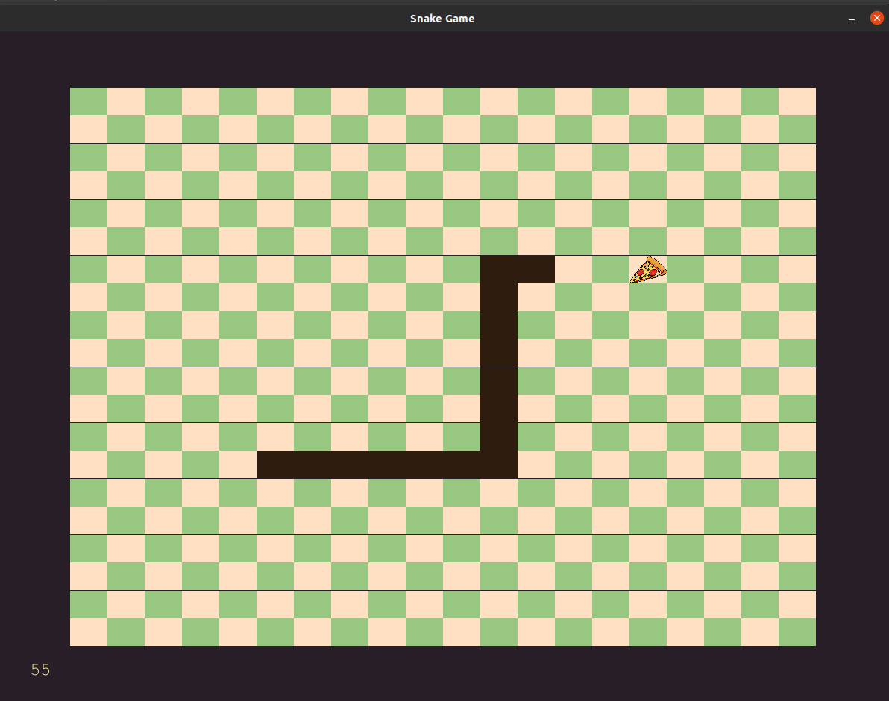

# Snake Game with Python3 and Pygame
## Screenshots

## How to Run
First, make sure you have pygame installed on your computer. then, you can run the game by  `python main.py`

You can also use **pipenv** to install dependecies:

    pipenv shell
    pipenv sync
    python main.py